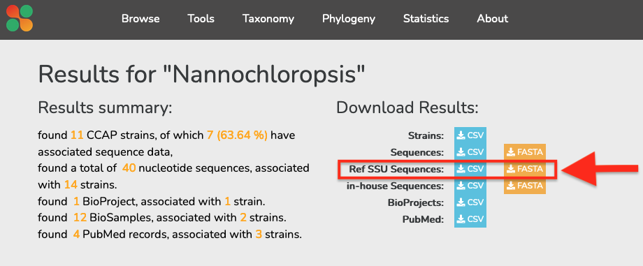
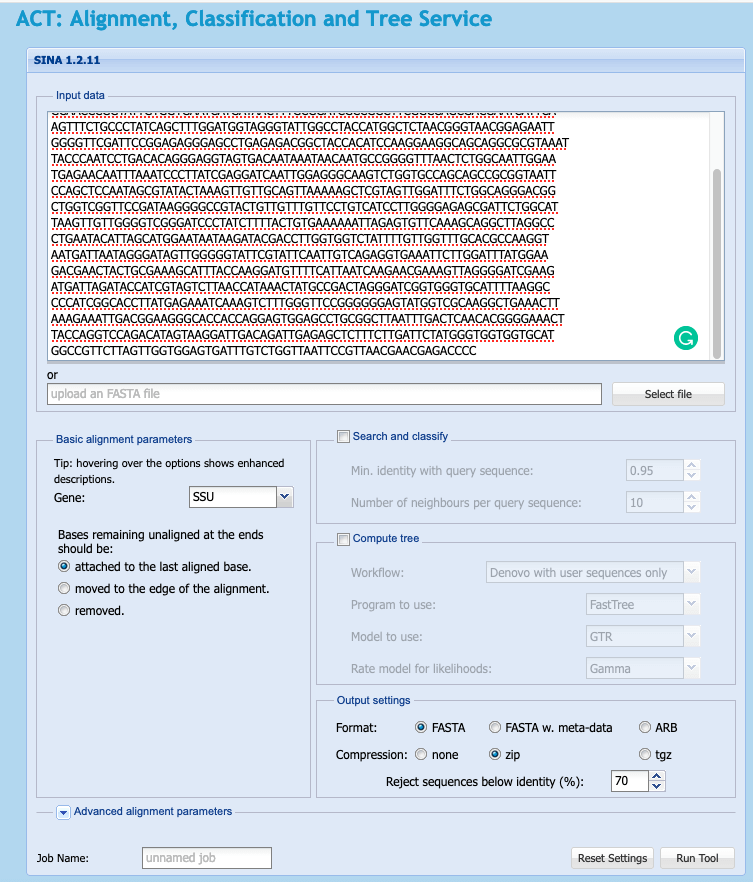
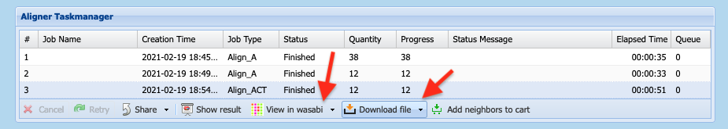
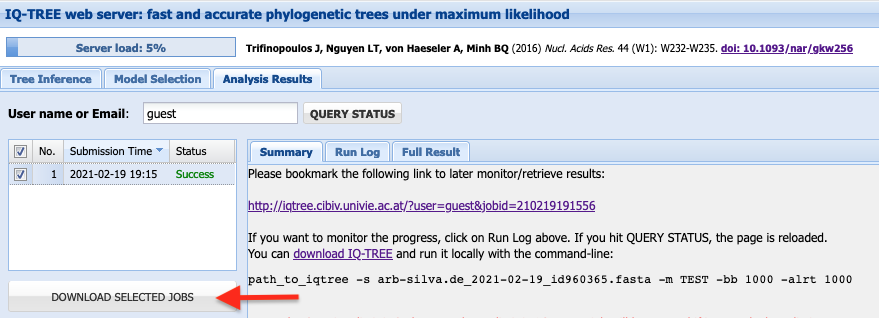

---
title: Phylogenetics
parent: CCAPcource2021
nav_order: 1
--- 

# Quick-and-easy SSU Phylogenies

F. De Boever & D. Green

 * [https://fdboever.github.io/CCAP_course_2021/
](https://fdboever.github.io/CCAP_course_2021/)
 * All files used in this tutorial are accessible via [github](https://github.com/FDBoever/CCAP_course_2021)

## Introduction

### What is this about?

This tutorial is meant as a guide for obtaining and using sequence data from our [sequence collection](...) to build and visualise phylogenetic trees using freely available online tools. This is not a course on the [theory of phylogenetics](https://www.ebi.ac.uk/training/online/courses/introduction-to-phylogenetics/what-is-phylogenetics/), nor is it designed for more advanced phylogenetic analysis. Instead, the aim of this tutrial is to show a quick-and-easy, yet, powerful approach to build and beautify robust phylogenetic trees based on SSU rDNA sequences.

### What will you achieve?

* [Step 1](#step-1-download-ssu-sequences-and-associated-metadata): Download SSU sequences and associated metadata from the CCAP sequence collection
* [Step 2](#step-2-align-ssu-sequences-using-silva): Align SSU sequences using Silva
* [Step 3](#step-3-build-phylogeny-using-iq-tree): Build phylogenetic trees using IQ-TREE
* [Step 4](#step-4-visualise-and-annotate-phylogenetic-trees): Visualise and annotate phylogenetic trees

### What is required
 * internet browser
 * patience
 * tool to unpack .zip files

 
 
## Step 1: Download SSU sequences and associated metadata
To build molecular phylogenies, we need a gene that is present in all organisms we want to relate. Owing to it's ubiquity, the small-subunit (SSU) rDNA sequence has been proposed as a phylogenetic marker to infer universal relatedness of all life (Carl Woese, 1977), and since became the most popular marker to study relatedness and diveristy of prokaryotes (16S) and eukaryotes (18S). Thanks to it's populatirity, and continuous advances in sequenceing technologies, the SSU rDNA gene has been routenely sequenced from both cultured organisms as well as environmental samples, covering the enormous taxonomic diversity of life. 

At CCAP, there is a continuous effort to "barcode" the entire culture collection with a focus on the rDNA operon. Moreover, researches around the globe continue to sequence DNA from CCAP strains, resulting in a growing amount of data that is often difficult to find, or link back to the organisms and it's metadata. To facilitate the use of sequence data associated with the CCAP culture collection, we recently developed an in-house sequence database that is publically accessible via a [website](http://vallarta:3838/test-ccap-app/#!/). Its aim is to provide a central platform that allows users to browse and access CCAP-associated sequences, meta-data and common analysis results.

In this tutorial, we will browse and download sequence data from the website, and show-case it's usage by building  phylogenetic trees. In this step you will obtain a fasta file with the sequences to build a tree, and a TXT file that will be useful to annotate the tree later on.

### Procedure

 * Go to [CCAPs' bioinformatics Gateway](http://vallarta:3838/test-ccap-app/)
 * Search for "Nannochloropsis" 
 * Click on the `CSV` and `FASTA` (Ref SSU Sequences) download buttons on the top of the screen, as indicated in the image below
 * Save the files somewhere sensible on your computer

 

 

## Step 2: Align SSU sequences using Silva
Although we have now obtained a number of homologous 18S sequences, they may vary in length and composition. Prior to infering evolutionary relationships between sequenes, we need to identify homologous sites in these sequences, by  generating sequence alignments. Due to evolution (substitutions, insertions/deletions), sequence errors and analysis errors, it is often not trivial to know when the same site in two different sequences is homologous. Many tools exist for aligning multiple sequences (muscle, mafft, clustalw, t-coffee, ...), some of which can include information of the molecule's secondary structure to help assign homologous sites. A widely used method for aligning SSU/LSU sequences is the [Silva-alignment tool](https://www.arb-silva.de/aligner/), which uses structural information and a manually curated super-alignment to align a set of input sequences. 

### Procedure

 * Go to [https://www.arb-silva.de/aligner/](https://www.arb-silva.de/aligner/)
 * paste your the content of your fasta file inside the text field or click "select file"
 * you can leave the default settings and click the `Run Tool` button.
 * this job may take a minute to compute, you can follow it's progress in the `Alignment Taskmanager`
 
  
 

 * Once finished to click on the job in the `Alignment Taskmanager`
 * To download the sequence alignments click on `Download File` and chose zip 
 
 

Great, you now aligned your 18S sequences! It is always advised to inspect your  alignments before continuing to build a tree. 

 * Consider to explore the alignment using `wasabi` or other free-tools such as   [aliview](https://ormbunkar.se/aliview/)

### use Wasabi to trim sequence
1. Click on the settings icon (cogs) at the top of the wasabi screen and select "hide gaps"
2. we can remove positions that are only represented by x sequences. In this example we have 12 sequences, and we want to retain only those positions present in all. So we fill in 11 (12-1) and click "Apply" (see figure)
3. to export the trimmed alignment click on the file icon at the top of the screen and select export, change the name if you like, and leave the default settings.

## Step 3: Build phylogeny using IQ-TREE

Now that we are reasonably confident about our identification of homologous characters across our sequences (e.g. the alignment), we can build a phylogenetic tree. A variety of very distinct and often complex algorithm (Parsimony, Maximum-likelihood, Bayesian) exist, and resulting trees are often clouded by uncertainty of certain branching patterns expressed in likelihoods and probabilities. Although phylogenetics often appears like a dark art, these methods share the goal to find a tree that best explains the character data according to evolutionary process and an optimality criterion. In essense many possible trees are compared and the tree with the best value wins, representing the single "best" phylogeny. For example, one such optimality criterion is Maximum-likelihood, where the tree that maximising the likelihood of observing the character matrix and a given model of character evolution wins.

We will use [IQ-tree](https://doi.org/10.1093/nar/gkw256), an excelent and well maintained platform for phylogenetic analysis (notable alternatives are PAUP, Phylip, RAxML for Maximim-likelihood, PAUP, TNT for parsimony and PhyloBayes, MrBayes for Bayesian inference). We will use the alignment obtained in previous step.

### Procedure

 * Go to [IQ-TREE web server](http://iqtree.cibiv.univie.ac.at/)
 * upload your alignment file by clicking "Bowse..." in the Input Data section
 * We can specify Sequence type as DNA and leave the rest at the default settings.
 * If you want to explore alternative settings, or manually specify the substicution model, and or bootstrap method.
 * The more sequences you input the longer the computation time, so consider inputting your email adress at the bottom of the screen before submitting the job.
 * submit and wait until the job is finished.

 * Once completed, download and unzip the files
 * your tree is stored in a file with extention .treefile 
 
 
 

## Step 4: Visualise and annotate phylogenetic trees

Infomation associated with taxon may be analysed in the context of the evolutionary history, for example trees can be annotated using metadata, such as isolation source, taxonomy, etc. Here are some examples of online and offline tools that are worth exploring

### iTOL

[iTOL](https://itol.embl.de/) is an excelent online tool to visualise trees. 

 1. go to [iTOL website](https://itol.embl.de/upload.cgi)
 2. You can register if you want your trees to be remembered, or click on the "upload" tab
 3. you can drag and drop your tree file here, or select it from you browser

### FigTree
[FigTree](http://tree.bio.ed.ac.uk/software/figtree/) is a small and handy program you can download for free, it is very intuitive and offers a great deal of visualisation options

1. Download and install [FigTree](http://tree.bio.ed.ac.uk/software/figtree/)
2. Open FigTree
3. Open the tree in Figtree by clicking File > Open...
4. Click on File again and click "Import Annotations..." 
5. Click on “Node Labels” on the left tab and choose “Display”
as “strainName” and colour as "Genus_Name", see figure below. 

### R

Several R packages exist to visualise trees, such as `ggtree` with great documentation ([ggtree-book](https://guangchuangyu.github.io/ggtree-book/)).  

Alternatively, you can have a look at our tutorial ["Visualise trees in R"](https://fdboever.github.io/CCAP_course_2021/visualise_tree_R.html)

 
 

### Note

> You will have noticed that initially we looked for Nannochloropsis strains on the CCAP site, and now reveal a phylogeny with two main groups, one of which contains Microchloropsis strains. Why? 
> 
> In 2015 [Fawley et al.](https://doi.org/10.2216/15-60.1) recognised this split and revised the taxonomy of Nannochloropsis with the errection of a new genus Microchloropsis. Microchloropsis gaditana and M. salina used to be called Nannochloropsis gadicata and N. gaditana respectively. Although CCAP has renamed it's strains accodingly, NCBI metadata keeps their original submission name, and hence we picked it up.
> 
> Also our tree supports the idea of two distinct lineages in what used to be called the Nannochloropsis lineage
> This also shows that we need to be careful, and check the origin and metadata of sequences obtained from public repositories. If you would only be interested in building phylogeny of Nannochloropsis sensu strictu, you could remove the unwanted sequences from the fasta file and repeat the above proces... 

