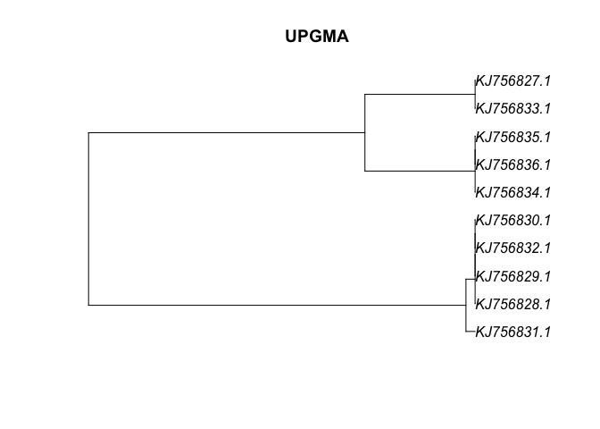
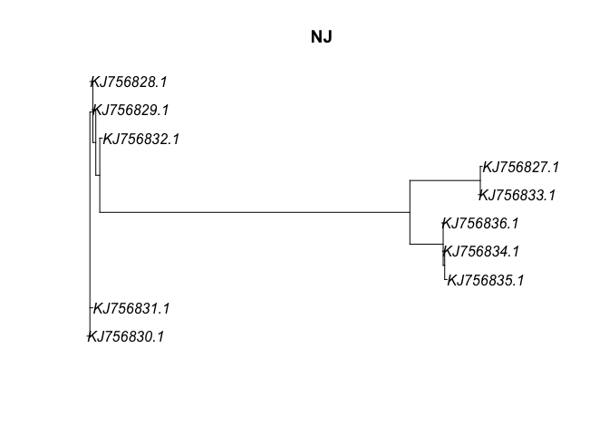
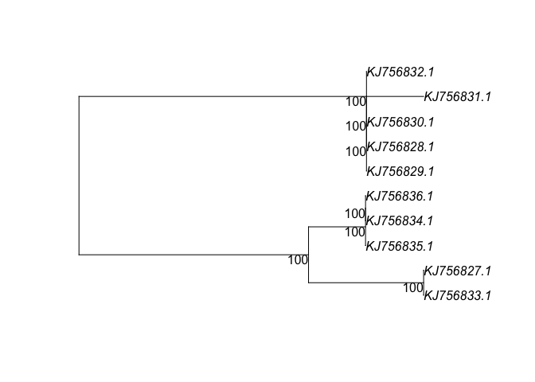

## Introduction

This is an R Markdown document that will guide you through some basic R code for phylogenetic analysis.


## Getting set up


```r
setwd("~/Github/CCAP_course/main/examlpes")
```


```r
library(seqinr) #to read in fasta files
library(msa) #for sequence alignments
```

```
## Loading required package: Biostrings
```

```
## Loading required package: BiocGenerics
```

```
## Loading required package: parallel
```

```
## 
## Attaching package: 'BiocGenerics'
```

```
## The following objects are masked from 'package:parallel':
## 
##     clusterApply, clusterApplyLB, clusterCall, clusterEvalQ,
##     clusterExport, clusterMap, parApply, parCapply, parLapply,
##     parLapplyLB, parRapply, parSapply, parSapplyLB
```

```
## The following objects are masked from 'package:stats':
## 
##     IQR, mad, sd, var, xtabs
```

```
## The following objects are masked from 'package:base':
## 
##     anyDuplicated, append, as.data.frame, basename, cbind, colnames,
##     dirname, do.call, duplicated, eval, evalq, Filter, Find, get, grep,
##     grepl, intersect, is.unsorted, lapply, Map, mapply, match, mget,
##     order, paste, pmax, pmax.int, pmin, pmin.int, Position, rank,
##     rbind, Reduce, rownames, sapply, setdiff, sort, table, tapply,
##     union, unique, unsplit, which, which.max, which.min
```

```
## Loading required package: S4Vectors
```

```
## Loading required package: stats4
```

```
## 
## Attaching package: 'S4Vectors'
```

```
## The following object is masked from 'package:base':
## 
##     expand.grid
```

```
## Loading required package: IRanges
```

```
## Loading required package: XVector
```

```
## 
## Attaching package: 'Biostrings'
```

```
## The following object is masked from 'package:seqinr':
## 
##     translate
```

```
## The following object is masked from 'package:base':
## 
##     strsplit
```

```r
library(ape) #to work with phylogenies
```

```
## 
## Attaching package: 'ape'
```

```
## The following object is masked from 'package:Biostrings':
## 
##     complement
```

```
## The following objects are masked from 'package:seqinr':
## 
##     as.alignment, consensus
```

```r
library(phangorn) #to build phylogenies
library(ips)
```

## Alignment

##

```r
#fasta <- readDNAStringSet("~/Github/CCAP_course/main/examlpes/arb-silva.de_2021-02-19_id960365.fasta",format='fasta')
#conversion between formats
#fasta <- as.DNAbin(fasta)
#trimEnds(fasta)
```


```r
# Import data [fasta.dna=https://pastebin.com/8Mt3QUTV]
#fasta <- read.dna("~/Github/CCAP_course/main/examlpes/arb-silva.de_2021-02-19_id960365.fasta",format='fasta')


fasta <- as.DNAbin(read.alignment("~/Github/CCAP_course/main/examlpes/arb-silva.de_2021-02-19_id960365.fasta",format='fasta'))
fasta <- trimEnds(fasta)
fasta_phyDat <- phyDat(fasta, type = "DNA")
```

```
## Warning in phyDat.DNA(data, return.index = return.index, ...): Found unknown
## characters. Deleted sites with with unknown states.
```

```r
# Subset (first ten)
fasta10 <- subset(fasta_phyDat, 1:10)
fasta10_phyDat <- phyDat(fasta10, type = "DNA", levels = NULL)
```

## model testing
One option is to convert the alignment into a pairwise distances, which will speed up the inference of a tree. We'll need to decide on the model of nucleotide evolution that best fits the data, performing a likelihood ratio test as implemented in modelTest.


```r
mt <- modelTest(fasta10)
```

```
## negative edges length changed to 0!
```

```
## [1] "JC+I"
## [1] "JC+G"
## [1] "JC+G+I"
## [1] "F81+I"
## [1] "F81+G"
## [1] "F81+G+I"
## [1] "K80+I"
## [1] "K80+G"
## [1] "K80+G+I"
## [1] "HKY+I"
## [1] "HKY+G"
## [1] "HKY+G+I"
## [1] "SYM+I"
## [1] "SYM+G"
## [1] "SYM+G+I"
## [1] "GTR+I"
## [1] "GTR+G"
## [1] "GTR+G+I"
```

```r
print(mt)
```

```
##      Model df    logLik      AIC          AICw     AICc         AICcw      BIC
## 1       JC 17 -1849.785 3733.571 6.526902e-166 3733.586 6.552528e-166 3880.387
## 2     JC+I 17 -1849.785 3733.571 6.526903e-166 3733.586 6.552528e-166 3880.387
## 3     JC+G 18 -1849.785 3735.571 2.401010e-166 3735.587 2.408351e-166 3891.023
## 4   JC+G+I 18 -1849.785 3735.571 2.401010e-166 3735.587 2.408351e-166 3891.023
## 5      F81 20 -1468.953 2977.906  8.038422e-02 2977.927  8.047890e-02 3150.631
## 6    F81+I 20 -1468.953 2977.906  8.038423e-02 2977.927  8.047891e-02 3150.631
## 7    F81+G 21 -1468.953 2979.906  2.957079e-02 2979.929  2.957573e-02 3161.268
## 8  F81+G+I 21 -1468.953 2979.906  2.957079e-02 2979.929  2.957574e-02 3161.268
## 9      K80 18 -1846.292 3728.583 7.902693e-165 3728.600 7.926855e-165 3884.036
## 10   K80+I 18 -1846.292 3728.583 7.902694e-165 3728.600 7.926856e-165 3884.036
## 11   K80+G 19 -1846.292 3730.583 2.907157e-165 3730.602 2.913382e-165 3894.672
## 12 K80+G+I 19 -1846.292 3730.583 2.907157e-165 3730.602 2.913382e-165 3894.672
## 13     HKY 21 -1466.718 2975.436  2.765137e-01 2975.458  2.765599e-01 3156.797
## 14   HKY+I 21 -1466.718 2975.436  2.765138e-01 2975.458  2.765600e-01 3156.797
## 15   HKY+G 22 -1466.718 2977.436  1.017215e-01 2977.460  1.016309e-01 3167.433
## 16 HKY+G+I 22 -1466.718 2977.436  1.017215e-01 2977.460  1.016309e-01 3167.433
## 17     SYM 22 -1841.096 3726.191 2.613486e-164 3726.215 2.611158e-164 3916.188
## 18   SYM+I 22 -1841.096 3726.191 2.613486e-164 3726.215 2.611159e-164 3916.188
## 19   SYM+G 23 -1841.096 3728.191 9.614253e-165 3728.218 9.595070e-165 3926.825
## 20 SYM+G+I 23 -1841.096 3728.191 9.614254e-165 3728.218 9.595071e-165 3926.825
## 21     GTR 25 -1466.184 2982.369  8.633666e-03 2982.400  8.596155e-03 3198.275
## 22   GTR+I 25 -1466.184 2982.369  8.633670e-03 2982.400  8.596159e-03 3198.275
## 23   GTR+G 26 -1466.184 2984.369  3.176088e-03 2984.402  3.158336e-03 3208.911
## 24 GTR+G+I 26 -1466.184 2984.369  3.176089e-03 2984.402  3.158337e-03 3208.911
```

```r
dna_dist <- dist.ml(fasta10, model="JC")
```

Neighbor Joining and UPGMA
We can estimate trees from distance matrices using neighbor-joining and UPGMA algorithims


```r
fasta_UPGMA <- upgma(dna_dist)
fasta_NJ  <- NJ(dna_dist)
plot(fasta_UPGMA, main="UPGMA")
```

<!-- -->

```r
plot(fasta_NJ, main="NJ")
```

<!-- -->

Which tree firts our data best? we can use parsimony() function to compare their respective parsimony scores. The function like optim.parsimony() and prachet() takes this a little further, and are worth exploring

## Maximum likelihood and bootstrapping

calculate the likelihood of a given tree using pml(), and use the function optim.pml() to optimize tree tolopogies and branch lengths for your selected model of nucleotide evolution


```r
fit <- pml(fasta_NJ, fasta10)
```

```
## negative edges length changed to 0!
```

```r
print(fit)
```

```
## 
##  loglikelihood: -1850.391 
## 
## unconstrained loglikelihood: -7555.037 
## 
## Rate matrix:
##   a c g t
## a 0 1 1 1
## c 1 0 1 1
## g 1 1 0 1
## t 1 1 1 0
## 
## Base frequencies:  
## 0.25 0.25 0.25 0.25
```


```r
fitJC <- optim.pml(fit, model = "JC", rearrangement = "stochastic")
```

```
## optimize edge weights:  -1850.391 --> -1849.785 
## optimize edge weights:  -1849.785 --> -1849.785 
## optimize topology:  -1849.785 --> -1849.785 
## optimize topology:  -1849.785 --> -1849.785 
## optimize topology:  -1849.785 --> -1849.785 
## 2 
## optimize edge weights:  -1849.785 --> -1849.785 
## optimize topology:  -1849.785 --> -1849.785 
## 0 
## [1] "Ratchet iteration  1 , best pscore so far: -1849.78533514409"
## [1] "Ratchet iteration  2 , best pscore so far: -1849.78533514409"
## [1] "Ratchet iteration  3 , best pscore so far: -1849.78533514409"
## [1] "Ratchet iteration  4 , best pscore so far: -1849.78533514409"
## [1] "Ratchet iteration  5 , best pscore so far: -1849.78533514409"
## [1] "Ratchet iteration  6 , best pscore so far: -1849.78533514409"
## [1] "Ratchet iteration  7 , best pscore so far: -1849.78533514409"
## [1] "Ratchet iteration  8 , best pscore so far: -1849.78533514409"
## [1] "Ratchet iteration  9 , best pscore so far: -1849.78533514409"
## [1] "Ratchet iteration  10 , best pscore so far: -1849.78533514409"
## [1] "Ratchet iteration  11 , best pscore so far: -1849.78533514409"
## [1] "Ratchet iteration  12 , best pscore so far: -1849.78533514409"
## [1] "Ratchet iteration  13 , best pscore so far: -1849.78533514409"
## [1] "Ratchet iteration  14 , best pscore so far: -1849.78533514409"
## [1] "Ratchet iteration  15 , best pscore so far: -1849.78533514409"
## [1] "Ratchet iteration  16 , best pscore so far: -1849.78533514409"
## [1] "Ratchet iteration  17 , best pscore so far: -1849.78533514409"
## [1] "Ratchet iteration  18 , best pscore so far: -1849.78533514409"
## [1] "Ratchet iteration  19 , best pscore so far: -1849.78533514409"
## [1] "Ratchet iteration  20 , best pscore so far: -1849.78533514409"
## optimize edge weights:  -1849.785 --> -1849.785 
## optimize topology:  -1849.785 --> -1849.785 
## 0 
## optimize edge weights:  -1849.785 --> -1849.785
```


```r
bs <- bootstrap.pml(fitJC, bs=100, control = pml.control(trace=0))
plotBS(midpoint(fitJC$tree), bs, p = 50, type="p")
```

<!-- -->


## Exporting trees

```r
write.tree(bs, file="bootstrap_example.tre")
```


