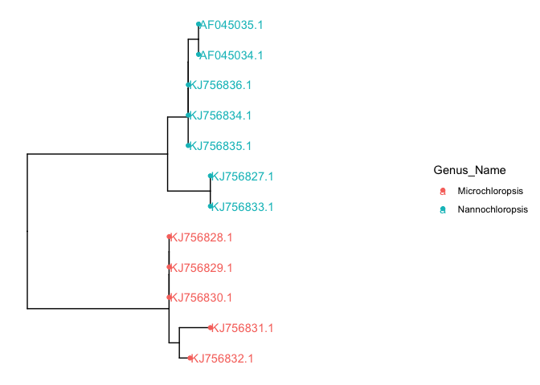

In this short tutorial we show how to use ggtree to quickly visualise and annotate trees in R. Although excelent documentation exists for this package, this tutorial contains some tips of what I find are the easiests ways to combine metadata and a tree.


```r
# for general data maniuplarion
library(dplyr)
```

```
## 
## Attaching package: 'dplyr'
```

```
## The following objects are masked from 'package:stats':
## 
##     filter, lag
```

```
## The following objects are masked from 'package:base':
## 
##     intersect, setdiff, setequal, union
```

```r
# for visualisation
library(ggplot2)
library(ggtree)
```

```
## Registered S3 method overwritten by 'treeio':
##   method     from
##   root.phylo ape
```

```
## ggtree v2.5.1  For help: https://yulab-smu.top/treedata-book/
## 
## If you use ggtree in published research, please cite the most appropriate paper(s):
## 
## 1. Guangchuang Yu. Using ggtree to visualize data on tree-like structures. Current Protocols in Bioinformatics, 2020, 69:e96. doi:10.1002/cpbi.96
## 2. Guangchuang Yu, Tommy Tsan-Yuk Lam, Huachen Zhu, Yi Guan. Two methods for mapping and visualizing associated data on phylogeny using ggtree. Molecular Biology and Evolution 2018, 35(12):3041-3043. doi:10.1093/molbev/msy194
## 3. Guangchuang Yu, David Smith, Huachen Zhu, Yi Guan, Tommy Tsan-Yuk Lam. ggtree: an R package for visualization and annotation of phylogenetic trees with their covariates and other associated data. Methods in Ecology and Evolution 2017, 8(1):28-36. doi:10.1111/2041-210X.12628
```

```r
#for phylogenetics
library(ape)
```

```
## 
## Attaching package: 'ape'
```

```
## The following object is masked from 'package:ggtree':
## 
##     rotate
```

```r
library(phytools)
```

```
## Loading required package: maps
```

## Loading data files
load in the metadata, in this example we use the metadata file obtained in previous tutorial. This file is in a tab-delimited format, hence we can use read.delim() function from base R. 


```r
#load metadata file
metadata <- read.delim("~/Github/CCAP_course/main/examlpes/CCAP_SSURef_Sequence_Metadata_Nannochloropsis_2021-02-22123.txt")
head(metadata)
```

```
##   accession_version
## 1        KJ756836.1
## 2        KJ756835.1
## 3        KJ756834.1
## 4        KJ756833.1
## 5        KJ756832.1
## 6        KJ756831.1
##                                                                            Strain
## 1 <a href='?strainIds=CCAP849_10#!/strainDetails' target='_blank'>CCAP 849/10</a>
## 2   <a href='?strainIds=CCAP849_9#!/strainDetails' target='_blank'>CCAP 849/9</a>
## 3   <a href='?strainIds=CCAP849_8#!/strainDetails' target='_blank'>CCAP 849/8</a>
## 4   <a href='?strainIds=CCAP849_7#!/strainDetails' target='_blank'>CCAP 849/7</a>
## 5   <a href='?strainIds=CCAP849_6#!/strainDetails' target='_blank'>CCAP 849/6</a>
## 6   <a href='?strainIds=CCAP849_5#!/strainDetails' target='_blank'>CCAP 849/5</a>
##   length moltype create_date
## 1   1745     DNA 19-JUL-2014
## 2   1745     DNA 19-JUL-2014
## 3   1735     DNA 19-JUL-2014
## 4   1731     DNA 19-JUL-2014
## 5   1741     DNA 19-JUL-2014
## 6   1797     DNA 19-JUL-2014
##                                                                             definition
## 1 Nannochloropsis oceanica strain CCAP 849/10 18S ribosomal RNA gene, partial sequence
## 2  Nannochloropsis oceanica strain CCAP 849/9 18S ribosomal RNA gene, partial sequence
## 3  Nannochloropsis oceanica strain CCAP 849/8 18S ribosomal RNA gene, partial sequence
## 4   Nannochloropsis oculata strain CCAP 849/7 18S ribosomal RNA gene, partial sequence
## 5  Nannochloropsis gaditana strain CCAP 849/6 18S ribosomal RNA gene, partial sequence
## 6  Nannochloropsis gaditana strain CCAP 849/5 18S ribosomal RNA gene, partial sequence
##                     source                 organism CCAP_RefSeq SeqSource
## 1 Nannochloropsis oceanica Nannochloropsis oceanica   Reference  in-house
## 2 Nannochloropsis oceanica Nannochloropsis oceanica   Reference  in-house
## 3 Nannochloropsis oceanica Nannochloropsis oceanica   Reference  in-house
## 4  Nannochloropsis oculata  Nannochloropsis oculata   Reference  in-house
## 5 Nannochloropsis gaditana Nannochloropsis gaditana   Reference  in-house
## 6 Nannochloropsis gaditana Nannochloropsis gaditana   Reference  in-house
##                             strainName qSpecies_No_Letter Genus_No Species_No
## 1 Nannochloropsis oceanica CCAP 849/10             849/10      849         10
## 2       Nannochloropsis sp. CCAP 849/9              849/9      849          9
## 3       Nannochloropsis sp. CCAP 849/8              849/8      849          8
## 4   Nannochloropsis oculata CCAP 849/7              849/7      849          7
## 5  Microchloropsis gaditana CCAP 849/6              849/6      849          6
## 6  Microchloropsis gaditana CCAP 849/5              849/5      849          5
##   Species_No_Letter      Genus_Name Species.SVF_name Isolator Isolation_Year
## 1                NA Nannochloropsis         oceanica  Sandnes           2004
## 2                NA Nannochloropsis              sp. Kitajima               
## 3                NA Nannochloropsis              sp.       Li               
## 4                NA Nannochloropsis          oculata    Stirn           1969
## 5                NA Microchloropsis         gaditana   Ryther           1952
## 6                NA Microchloropsis         gaditana   Lubian       pre 1977
##                Orig_Desig         Equiv_Strains Other_Desigs Type_Culture
## 1                                                                        
## 2                                 CSIRO CS-1117                          
## 3   Orig. desig. MACC0938               CCMP531                          
## 4      Orig. desig. Tunis CCMP533; CSIRO CS-192                          
## 5 Orig. desig. GSB Sticho               CCMP527                          
## 6                                                   SMBA 269 TYPE CULTURE
##   Pathogen Environment                               Geog_Location Curator
## 1       NA      Marine        operational hatchery, western Norway      JF
## 2       NA      Marine                                       Japan      JF
## 3       NA      Marine                              Qingdao, China      NT
## 4       NA      Marine                      Lake of Tunis, Tunisia      NT
## 5       NA      Marine Great South Bay, Long Island, New York, USA      NT
## 6       NA      Marine                     Cadiz Bay, Cadiz, Spain      JF
##                                                                                  Taxonomy
## 1 Heterokontophyta/Ochrophyta (heterokont chromophytes), Eustigmatophyceae, Eustigmatales
## 2 Heterokontophyta/Ochrophyta (heterokont chromophytes), Eustigmatophyceae, Eustigmatales
## 3 Heterokontophyta/Ochrophyta (heterokont chromophytes), Eustigmatophyceae, Eustigmatales
## 4 Heterokontophyta/Ochrophyta (heterokont chromophytes), Eustigmatophyceae, Eustigmatales
## 5 Heterokontophyta/Ochrophyta (heterokont chromophytes), Eustigmatophyceae, Eustigmatales
## 6 Heterokontophyta/Ochrophyta (heterokont chromophytes), Eustigmatophyceae, Eustigmatales
##   Archived   strainID
## 1        N CCAP849_10
## 2        N  CCAP849_9
## 3        N  CCAP849_8
## 4        N  CCAP849_7
## 5        N  CCAP849_6
## 6        N  CCAP849_5
```

Similartly, we load in the associated tree, obtained in earlier tutorials. A fundamental package in R to deal with phylogenies is ape, we can use a function from that package called read.tree() to read trees.


```r
#load tree
tree <- ape::read.tree("~/Github/CCAP_course/main/examlpes/nannochloropsis_18S_iqtree.fasta.treefile")
```


In this case we have an unrooted tree, which is the default output of most phylogenetic analsysis. Since we may not know the outgroup, a commonly used alternative is to use mid point routing. This can be achieved using midpoint.root() function from the phytools package


```r
#mid point root
mid.point.rooted.tree <- midpoint.root(tree)
```

Next, we can order the tips in a way that is more presentable, branches are rotated (so topology remains the same), using a function called ladderize() from the ape package

```r
#ladderize
mid.point.rooted.tree <- ladderize(mid.point.rooted.tree)
```


## Basic visualisation

ape and phytools offer functions to visualise a phylogenetic tree using the generic plot() function. 
Yet a more powerful way to plot trees in R using the ggplot2 gramar is via the ggtree package.

A simple visualisation is generated by


```r
ggtree(mid.point.rooted.tree)
```

<!-- -->

```r
#add labels and a scale bar
ggtree(mid.point.rooted.tree) + 
	geom_tiplab() + 
	geom_treescale()
```

<!-- -->

## Link metadata to the tree
In this tutorial we wish to annotate the tree further, this is where ggtree becomes really powerful. Ggtree offers several solutions to link metadata to a tree, among which the groupOTU() function. In find that the easiet solution is to first generate a ggtree object and merge it's data with the metadata using for example dplyr.

First, store a ggtree object in a variable called p


```r
p <- ggtree(mid.point.rooted.tree)
p
```

<!-- -->

at this stage you could consider changing the overall layout of the tree by specifying arguments within the ggtree function


```r
# no branch lengths?
p.1 <- ggtree(mid.point.rooted.tree, branch.length='none')+geom_tiplab()
p.2 <- ggtree(mid.point.rooted.tree, layout='circular')+geom_tiplab()
p.3  <- ggtree(mid.point.rooted.tree, layout='fan', open.angle=180) + geom_tiplab()
```

```
## Scale for 'y' is already present. Adding another scale for 'y', which will
## replace the existing scale.
```


Consider our first ggtree object stored in the variable p
we can have a look at what is inside using the str() function. str() is very useful in general and should become one of your best friends in R

```r
str(p)
```

```
## List of 9
##  $ data       : tbl_tree [23 × 9] (S3: tbl_tree/tbl_tree/tbl_tree/tbl_df/tbl/data.frame)
##   ..$ parent       : int [1:23] 16 17 17 15 15 21 19 23 23 20 ...
##   ..$ node         : int [1:23] 1 2 3 4 5 6 7 8 9 10 ...
##   ..$ branch.length: num [1:23] 2.09e-06 2.19e-06 2.19e-06 5.77e-04 1.68e-03 ...
##   ..$ label        : chr [1:23] "KJ756830.1" "KJ756829.1" "KJ756828.1" "KJ756832.1" ...
##   ..$ isTip        : logi [1:23] TRUE TRUE TRUE TRUE TRUE TRUE ...
##   ..$ x            : num [1:23] 0.00766 0.00766 0.00766 0.00879 0.00989 ...
##   ..$ y            : num [1:23] 3 4 5 1 2 10 8 6 7 9 ...
##   ..$ branch       : num [1:23] 0.00766 0.00766 0.00766 0.0085 0.00905 ...
##   ..$ angle        : num [1:23] 90 120 150 30 60 300 240 180 210 270 ...
##   ..- attr(*, "layout")= chr "rectangular"
##  $ layers     :List of 2
##   ..$ :Classes 'LayerInstance', 'Layer', 'ggproto', 'gg' <ggproto object: Class LayerInstance, Layer, gg>
##     aes_params: list
##     compute_aesthetics: function
##     compute_geom_1: function
##     compute_geom_2: function
##     compute_position: function
##     compute_statistic: function
##     data: waiver
##     draw_geom: function
##     finish_statistics: function
##     geom: <ggproto object: Class GeomSegment, Geom, gg>
##         aesthetics: function
##         default_aes: uneval
##         draw_group: function
##         draw_key: function
##         draw_layer: function
##         draw_panel: function
##         extra_params: na.rm
##         handle_na: function
##         non_missing_aes: linetype size shape
##         optional_aes: 
##         parameters: function
##         required_aes: x y xend yend
##         setup_data: function
##         setup_params: function
##         use_defaults: function
##         super:  <ggproto object: Class Geom, gg>
##     geom_params: list
##     inherit.aes: TRUE
##     layer_data: function
##     map_statistic: function
##     mapping: uneval
##     position: <ggproto object: Class PositionIdentity, Position, gg>
##         compute_layer: function
##         compute_panel: function
##         required_aes: 
##         setup_data: function
##         setup_params: function
##         super:  <ggproto object: Class Position, gg>
##     print: function
##     setup_layer: function
##     show.legend: NA
##     stat: <ggproto object: Class StatTreeHorizontal, Stat, gg>
##         aesthetics: function
##         compute_group: function
##         compute_layer: function
##         compute_panel: function
##         default_aes: uneval
##         extra_params: na.rm
##         finish_layer: function
##         non_missing_aes: 
##         optional_aes: 
##         parameters: function
##         required_aes: node parent x y
##         retransform: TRUE
##         setup_data: function
##         setup_params: function
##         super:  <ggproto object: Class Stat, gg>
##     stat_params: list
##     super:  <ggproto object: Class Layer, gg> 
##   ..$ :Classes 'LayerInstance', 'Layer', 'ggproto', 'gg' <ggproto object: Class LayerInstance, Layer, gg>
##     aes_params: list
##     compute_aesthetics: function
##     compute_geom_1: function
##     compute_geom_2: function
##     compute_position: function
##     compute_statistic: function
##     data: waiver
##     draw_geom: function
##     finish_statistics: function
##     geom: <ggproto object: Class GeomSegment, Geom, gg>
##         aesthetics: function
##         default_aes: uneval
##         draw_group: function
##         draw_key: function
##         draw_layer: function
##         draw_panel: function
##         extra_params: na.rm
##         handle_na: function
##         non_missing_aes: linetype size shape
##         optional_aes: 
##         parameters: function
##         required_aes: x y xend yend
##         setup_data: function
##         setup_params: function
##         use_defaults: function
##         super:  <ggproto object: Class Geom, gg>
##     geom_params: list
##     inherit.aes: TRUE
##     layer_data: function
##     map_statistic: function
##     mapping: uneval
##     position: <ggproto object: Class PositionIdentity, Position, gg>
##         compute_layer: function
##         compute_panel: function
##         required_aes: 
##         setup_data: function
##         setup_params: function
##         super:  <ggproto object: Class Position, gg>
##     print: function
##     setup_layer: function
##     show.legend: NA
##     stat: <ggproto object: Class StatTreeVertical, Stat, gg>
##         aesthetics: function
##         compute_group: function
##         compute_layer: function
##         compute_panel: function
##         default_aes: uneval
##         extra_params: na.rm
##         finish_layer: function
##         non_missing_aes: 
##         optional_aes: 
##         parameters: function
##         required_aes: node parent x y
##         retransform: TRUE
##         setup_data: function
##         setup_params: function
##         super:  <ggproto object: Class Stat, gg>
##     stat_params: list
##     super:  <ggproto object: Class Layer, gg> 
##  $ scales     :Classes 'ScalesList', 'ggproto', 'gg' <ggproto object: Class ScalesList, gg>
##     add: function
##     clone: function
##     find: function
##     get_scales: function
##     has_scale: function
##     input: function
##     n: function
##     non_position_scales: function
##     scales: list
##     super:  <ggproto object: Class ScalesList, gg> 
##  $ mapping    :List of 2
##   ..$ x: language ~x
##   .. ..- attr(*, ".Environment")=<environment: 0x7fac311c3008> 
##   ..$ y: language ~y
##   .. ..- attr(*, ".Environment")=<environment: 0x7fac311c3008> 
##   ..- attr(*, "class")= chr "uneval"
##  $ theme      :List of 93
##   ..$ line                      :List of 6
##   .. ..$ colour       : chr "black"
##   .. ..$ size         : num 0.5
##   .. ..$ linetype     : num 1
##   .. ..$ lineend      : chr "butt"
##   .. ..$ arrow        : logi FALSE
##   .. ..$ inherit.blank: logi TRUE
##   .. ..- attr(*, "class")= chr [1:2] "element_line" "element"
##   ..$ rect                      :List of 5
##   .. ..$ fill         : chr "white"
##   .. ..$ colour       : chr "black"
##   .. ..$ size         : num 0.5
##   .. ..$ linetype     : num 1
##   .. ..$ inherit.blank: logi TRUE
##   .. ..- attr(*, "class")= chr [1:2] "element_rect" "element"
##   ..$ text                      :List of 11
##   .. ..$ family       : chr ""
##   .. ..$ face         : chr "plain"
##   .. ..$ colour       : chr "black"
##   .. ..$ size         : num 11
##   .. ..$ hjust        : num 0.5
##   .. ..$ vjust        : num 0.5
##   .. ..$ angle        : num 0
##   .. ..$ lineheight   : num 0.9
##   .. ..$ margin       : 'margin' num [1:4] 0pt 0pt 0pt 0pt
##   .. .. ..- attr(*, "valid.unit")= int 8
##   .. .. ..- attr(*, "unit")= chr "pt"
##   .. ..$ debug        : logi FALSE
##   .. ..$ inherit.blank: logi TRUE
##   .. ..- attr(*, "class")= chr [1:2] "element_text" "element"
##   ..$ title                     : NULL
##   ..$ aspect.ratio              : NULL
##   ..$ axis.title                : NULL
##   ..$ axis.title.x              :List of 11
##   .. ..$ family       : NULL
##   .. ..$ face         : NULL
##   .. ..$ colour       : NULL
##   .. ..$ size         : NULL
##   .. ..$ hjust        : NULL
##   .. ..$ vjust        : num 1
##   .. ..$ angle        : NULL
##   .. ..$ lineheight   : NULL
##   .. ..$ margin       : 'margin' num [1:4] 2.75pt 0pt 0pt 0pt
##   .. .. ..- attr(*, "valid.unit")= int 8
##   .. .. ..- attr(*, "unit")= chr "pt"
##   .. ..$ debug        : NULL
##   .. ..$ inherit.blank: logi TRUE
##   .. ..- attr(*, "class")= chr [1:2] "element_text" "element"
##   ..$ axis.title.x.top          :List of 11
##   .. ..$ family       : NULL
##   .. ..$ face         : NULL
##   .. ..$ colour       : NULL
##   .. ..$ size         : NULL
##   .. ..$ hjust        : NULL
##   .. ..$ vjust        : num 0
##   .. ..$ angle        : NULL
##   .. ..$ lineheight   : NULL
##   .. ..$ margin       : 'margin' num [1:4] 0pt 0pt 2.75pt 0pt
##   .. .. ..- attr(*, "valid.unit")= int 8
##   .. .. ..- attr(*, "unit")= chr "pt"
##   .. ..$ debug        : NULL
##   .. ..$ inherit.blank: logi TRUE
##   .. ..- attr(*, "class")= chr [1:2] "element_text" "element"
##   ..$ axis.title.x.bottom       : NULL
##   ..$ axis.title.y              :List of 11
##   .. ..$ family       : NULL
##   .. ..$ face         : NULL
##   .. ..$ colour       : NULL
##   .. ..$ size         : NULL
##   .. ..$ hjust        : NULL
##   .. ..$ vjust        : num 1
##   .. ..$ angle        : num 90
##   .. ..$ lineheight   : NULL
##   .. ..$ margin       : 'margin' num [1:4] 0pt 2.75pt 0pt 0pt
##   .. .. ..- attr(*, "valid.unit")= int 8
##   .. .. ..- attr(*, "unit")= chr "pt"
##   .. ..$ debug        : NULL
##   .. ..$ inherit.blank: logi TRUE
##   .. ..- attr(*, "class")= chr [1:2] "element_text" "element"
##   ..$ axis.title.y.left         : NULL
##   ..$ axis.title.y.right        :List of 11
##   .. ..$ family       : NULL
##   .. ..$ face         : NULL
##   .. ..$ colour       : NULL
##   .. ..$ size         : NULL
##   .. ..$ hjust        : NULL
##   .. ..$ vjust        : num 0
##   .. ..$ angle        : num -90
##   .. ..$ lineheight   : NULL
##   .. ..$ margin       : 'margin' num [1:4] 0pt 0pt 0pt 2.75pt
##   .. .. ..- attr(*, "valid.unit")= int 8
##   .. .. ..- attr(*, "unit")= chr "pt"
##   .. ..$ debug        : NULL
##   .. ..$ inherit.blank: logi TRUE
##   .. ..- attr(*, "class")= chr [1:2] "element_text" "element"
##   ..$ axis.text                 :List of 11
##   .. ..$ family       : NULL
##   .. ..$ face         : NULL
##   .. ..$ colour       : chr "grey30"
##   .. ..$ size         : 'rel' num 0.8
##   .. ..$ hjust        : NULL
##   .. ..$ vjust        : NULL
##   .. ..$ angle        : NULL
##   .. ..$ lineheight   : NULL
##   .. ..$ margin       : NULL
##   .. ..$ debug        : NULL
##   .. ..$ inherit.blank: logi TRUE
##   .. ..- attr(*, "class")= chr [1:2] "element_text" "element"
##   ..$ axis.text.x               : list()
##   .. ..- attr(*, "class")= chr [1:2] "element_blank" "element"
##   ..$ axis.text.x.top           :List of 11
##   .. ..$ family       : NULL
##   .. ..$ face         : NULL
##   .. ..$ colour       : NULL
##   .. ..$ size         : NULL
##   .. ..$ hjust        : NULL
##   .. ..$ vjust        : num 0
##   .. ..$ angle        : NULL
##   .. ..$ lineheight   : NULL
##   .. ..$ margin       : 'margin' num [1:4] 0pt 0pt 2.2pt 0pt
##   .. .. ..- attr(*, "valid.unit")= int 8
##   .. .. ..- attr(*, "unit")= chr "pt"
##   .. ..$ debug        : NULL
##   .. ..$ inherit.blank: logi TRUE
##   .. ..- attr(*, "class")= chr [1:2] "element_text" "element"
##   ..$ axis.text.x.bottom        : NULL
##   ..$ axis.text.y               : list()
##   .. ..- attr(*, "class")= chr [1:2] "element_blank" "element"
##   ..$ axis.text.y.left          : NULL
##   ..$ axis.text.y.right         :List of 11
##   .. ..$ family       : NULL
##   .. ..$ face         : NULL
##   .. ..$ colour       : NULL
##   .. ..$ size         : NULL
##   .. ..$ hjust        : num 0
##   .. ..$ vjust        : NULL
##   .. ..$ angle        : NULL
##   .. ..$ lineheight   : NULL
##   .. ..$ margin       : 'margin' num [1:4] 0pt 0pt 0pt 2.2pt
##   .. .. ..- attr(*, "valid.unit")= int 8
##   .. .. ..- attr(*, "unit")= chr "pt"
##   .. ..$ debug        : NULL
##   .. ..$ inherit.blank: logi TRUE
##   .. ..- attr(*, "class")= chr [1:2] "element_text" "element"
##   ..$ axis.ticks                :List of 6
##   .. ..$ colour       : chr "grey20"
##   .. ..$ size         : NULL
##   .. ..$ linetype     : NULL
##   .. ..$ lineend      : NULL
##   .. ..$ arrow        : logi FALSE
##   .. ..$ inherit.blank: logi TRUE
##   .. ..- attr(*, "class")= chr [1:2] "element_line" "element"
##   ..$ axis.ticks.x              : list()
##   .. ..- attr(*, "class")= chr [1:2] "element_blank" "element"
##   ..$ axis.ticks.x.top          : NULL
##   ..$ axis.ticks.x.bottom       : NULL
##   ..$ axis.ticks.y              : list()
##   .. ..- attr(*, "class")= chr [1:2] "element_blank" "element"
##   ..$ axis.ticks.y.left         : NULL
##   ..$ axis.ticks.y.right        : NULL
##   ..$ axis.ticks.length         : 'unit' num 2.75pt
##   .. ..- attr(*, "valid.unit")= int 8
##   .. ..- attr(*, "unit")= chr "pt"
##   ..$ axis.ticks.length.x       : NULL
##   ..$ axis.ticks.length.x.top   : NULL
##   ..$ axis.ticks.length.x.bottom: NULL
##   ..$ axis.ticks.length.y       : NULL
##   ..$ axis.ticks.length.y.left  : NULL
##   ..$ axis.ticks.length.y.right : NULL
##   ..$ axis.line                 :List of 6
##   .. ..$ colour       : chr "black"
##   .. ..$ size         : NULL
##   .. ..$ linetype     : NULL
##   .. ..$ lineend      : NULL
##   .. ..$ arrow        : logi FALSE
##   .. ..$ inherit.blank: logi FALSE
##   .. ..- attr(*, "class")= chr [1:2] "element_line" "element"
##   ..$ axis.line.x               : list()
##   .. ..- attr(*, "class")= chr [1:2] "element_blank" "element"
##   ..$ axis.line.x.top           : NULL
##   ..$ axis.line.x.bottom        : NULL
##   ..$ axis.line.y               : list()
##   .. ..- attr(*, "class")= chr [1:2] "element_blank" "element"
##   ..$ axis.line.y.left          : NULL
##   ..$ axis.line.y.right         : NULL
##   ..$ legend.background         :List of 5
##   .. ..$ fill         : NULL
##   .. ..$ colour       : logi NA
##   .. ..$ size         : NULL
##   .. ..$ linetype     : NULL
##   .. ..$ inherit.blank: logi TRUE
##   .. ..- attr(*, "class")= chr [1:2] "element_rect" "element"
##   ..$ legend.margin             : 'margin' num [1:4] 5.5pt 5.5pt 5.5pt 5.5pt
##   .. ..- attr(*, "valid.unit")= int 8
##   .. ..- attr(*, "unit")= chr "pt"
##   ..$ legend.spacing            : 'unit' num 11pt
##   .. ..- attr(*, "valid.unit")= int 8
##   .. ..- attr(*, "unit")= chr "pt"
##   ..$ legend.spacing.x          : NULL
##   ..$ legend.spacing.y          : NULL
##   ..$ legend.key                :List of 5
##   .. ..$ fill         : chr "white"
##   .. ..$ colour       : logi NA
##   .. ..$ size         : NULL
##   .. ..$ linetype     : NULL
##   .. ..$ inherit.blank: logi TRUE
##   .. ..- attr(*, "class")= chr [1:2] "element_rect" "element"
##   ..$ legend.key.size           : 'unit' num 1.2lines
##   .. ..- attr(*, "valid.unit")= int 3
##   .. ..- attr(*, "unit")= chr "lines"
##   ..$ legend.key.height         : NULL
##   ..$ legend.key.width          : NULL
##   ..$ legend.text               :List of 11
##   .. ..$ family       : NULL
##   .. ..$ face         : NULL
##   .. ..$ colour       : NULL
##   .. ..$ size         : 'rel' num 0.8
##   .. ..$ hjust        : NULL
##   .. ..$ vjust        : NULL
##   .. ..$ angle        : NULL
##   .. ..$ lineheight   : NULL
##   .. ..$ margin       : NULL
##   .. ..$ debug        : NULL
##   .. ..$ inherit.blank: logi TRUE
##   .. ..- attr(*, "class")= chr [1:2] "element_text" "element"
##   ..$ legend.text.align         : NULL
##   ..$ legend.title              :List of 11
##   .. ..$ family       : NULL
##   .. ..$ face         : NULL
##   .. ..$ colour       : NULL
##   .. ..$ size         : NULL
##   .. ..$ hjust        : num 0
##   .. ..$ vjust        : NULL
##   .. ..$ angle        : NULL
##   .. ..$ lineheight   : NULL
##   .. ..$ margin       : NULL
##   .. ..$ debug        : NULL
##   .. ..$ inherit.blank: logi TRUE
##   .. ..- attr(*, "class")= chr [1:2] "element_text" "element"
##   ..$ legend.title.align        : NULL
##   ..$ legend.position           : chr "right"
##   ..$ legend.direction          : NULL
##   ..$ legend.justification      : chr "center"
##   ..$ legend.box                : NULL
##   ..$ legend.box.just           : NULL
##   ..$ legend.box.margin         : 'margin' num [1:4] 0cm 0cm 0cm 0cm
##   .. ..- attr(*, "valid.unit")= int 1
##   .. ..- attr(*, "unit")= chr "cm"
##   ..$ legend.box.background     : list()
##   .. ..- attr(*, "class")= chr [1:2] "element_blank" "element"
##   ..$ legend.box.spacing        : 'unit' num 11pt
##   .. ..- attr(*, "valid.unit")= int 8
##   .. ..- attr(*, "unit")= chr "pt"
##   ..$ panel.background          :List of 5
##   .. ..$ fill         : chr "white"
##   .. ..$ colour       : chr "white"
##   .. ..$ size         : NULL
##   .. ..$ linetype     : NULL
##   .. ..$ inherit.blank: logi FALSE
##   .. ..- attr(*, "class")= chr [1:2] "element_rect" "element"
##   ..$ panel.border              : list()
##   .. ..- attr(*, "class")= chr [1:2] "element_blank" "element"
##   ..$ panel.spacing             : 'unit' num 5.5pt
##   .. ..- attr(*, "valid.unit")= int 8
##   .. ..- attr(*, "unit")= chr "pt"
##   ..$ panel.spacing.x           : NULL
##   ..$ panel.spacing.y           : NULL
##   ..$ panel.grid                :List of 6
##   .. ..$ colour       : chr "grey92"
##   .. ..$ size         : NULL
##   .. ..$ linetype     : NULL
##   .. ..$ lineend      : NULL
##   .. ..$ arrow        : logi FALSE
##   .. ..$ inherit.blank: logi TRUE
##   .. ..- attr(*, "class")= chr [1:2] "element_line" "element"
##   ..$ panel.grid.major          : list()
##   .. ..- attr(*, "class")= chr [1:2] "element_blank" "element"
##   ..$ panel.grid.minor          : list()
##   .. ..- attr(*, "class")= chr [1:2] "element_blank" "element"
##   ..$ panel.grid.major.x        : NULL
##   ..$ panel.grid.major.y        : NULL
##   ..$ panel.grid.minor.x        : NULL
##   ..$ panel.grid.minor.y        : NULL
##   ..$ panel.ontop               : logi FALSE
##   ..$ plot.background           :List of 5
##   .. ..$ fill         : NULL
##   .. ..$ colour       : chr "white"
##   .. ..$ size         : NULL
##   .. ..$ linetype     : NULL
##   .. ..$ inherit.blank: logi TRUE
##   .. ..- attr(*, "class")= chr [1:2] "element_rect" "element"
##   ..$ plot.title                :List of 11
##   .. ..$ family       : NULL
##   .. ..$ face         : NULL
##   .. ..$ colour       : NULL
##   .. ..$ size         : 'rel' num 1.2
##   .. ..$ hjust        : num 0
##   .. ..$ vjust        : num 1
##   .. ..$ angle        : NULL
##   .. ..$ lineheight   : NULL
##   .. ..$ margin       : 'margin' num [1:4] 0pt 0pt 5.5pt 0pt
##   .. .. ..- attr(*, "valid.unit")= int 8
##   .. .. ..- attr(*, "unit")= chr "pt"
##   .. ..$ debug        : NULL
##   .. ..$ inherit.blank: logi TRUE
##   .. ..- attr(*, "class")= chr [1:2] "element_text" "element"
##   ..$ plot.title.position       : chr "panel"
##   ..$ plot.subtitle             :List of 11
##   .. ..$ family       : NULL
##   .. ..$ face         : NULL
##   .. ..$ colour       : NULL
##   .. ..$ size         : NULL
##   .. ..$ hjust        : num 0
##   .. ..$ vjust        : num 1
##   .. ..$ angle        : NULL
##   .. ..$ lineheight   : NULL
##   .. ..$ margin       : 'margin' num [1:4] 0pt 0pt 5.5pt 0pt
##   .. .. ..- attr(*, "valid.unit")= int 8
##   .. .. ..- attr(*, "unit")= chr "pt"
##   .. ..$ debug        : NULL
##   .. ..$ inherit.blank: logi TRUE
##   .. ..- attr(*, "class")= chr [1:2] "element_text" "element"
##   ..$ plot.caption              :List of 11
##   .. ..$ family       : NULL
##   .. ..$ face         : NULL
##   .. ..$ colour       : NULL
##   .. ..$ size         : 'rel' num 0.8
##   .. ..$ hjust        : num 1
##   .. ..$ vjust        : num 1
##   .. ..$ angle        : NULL
##   .. ..$ lineheight   : NULL
##   .. ..$ margin       : 'margin' num [1:4] 5.5pt 0pt 0pt 0pt
##   .. .. ..- attr(*, "valid.unit")= int 8
##   .. .. ..- attr(*, "unit")= chr "pt"
##   .. ..$ debug        : NULL
##   .. ..$ inherit.blank: logi TRUE
##   .. ..- attr(*, "class")= chr [1:2] "element_text" "element"
##   ..$ plot.caption.position     : chr "panel"
##   ..$ plot.tag                  :List of 11
##   .. ..$ family       : NULL
##   .. ..$ face         : NULL
##   .. ..$ colour       : NULL
##   .. ..$ size         : 'rel' num 1.2
##   .. ..$ hjust        : num 0.5
##   .. ..$ vjust        : num 0.5
##   .. ..$ angle        : NULL
##   .. ..$ lineheight   : NULL
##   .. ..$ margin       : NULL
##   .. ..$ debug        : NULL
##   .. ..$ inherit.blank: logi TRUE
##   .. ..- attr(*, "class")= chr [1:2] "element_text" "element"
##   ..$ plot.tag.position         : chr "topleft"
##   ..$ plot.margin               : 'margin' num [1:4] 5.5pt 5.5pt 5.5pt 5.5pt
##   .. ..- attr(*, "valid.unit")= int 8
##   .. ..- attr(*, "unit")= chr "pt"
##   ..$ strip.background          :List of 5
##   .. ..$ fill         : chr "grey85"
##   .. ..$ colour       : chr "grey20"
##   .. ..$ size         : NULL
##   .. ..$ linetype     : NULL
##   .. ..$ inherit.blank: logi TRUE
##   .. ..- attr(*, "class")= chr [1:2] "element_rect" "element"
##   ..$ strip.background.x        : NULL
##   ..$ strip.background.y        : NULL
##   ..$ strip.placement           : chr "inside"
##   ..$ strip.text                :List of 11
##   .. ..$ family       : NULL
##   .. ..$ face         : NULL
##   .. ..$ colour       : chr "grey10"
##   .. ..$ size         : 'rel' num 0.8
##   .. ..$ hjust        : NULL
##   .. ..$ vjust        : NULL
##   .. ..$ angle        : NULL
##   .. ..$ lineheight   : NULL
##   .. ..$ margin       : 'margin' num [1:4] 4.4pt 4.4pt 4.4pt 4.4pt
##   .. .. ..- attr(*, "valid.unit")= int 8
##   .. .. ..- attr(*, "unit")= chr "pt"
##   .. ..$ debug        : NULL
##   .. ..$ inherit.blank: logi TRUE
##   .. ..- attr(*, "class")= chr [1:2] "element_text" "element"
##   ..$ strip.text.x              : NULL
##   ..$ strip.text.y              :List of 11
##   .. ..$ family       : NULL
##   .. ..$ face         : NULL
##   .. ..$ colour       : NULL
##   .. ..$ size         : NULL
##   .. ..$ hjust        : NULL
##   .. ..$ vjust        : NULL
##   .. ..$ angle        : num -90
##   .. ..$ lineheight   : NULL
##   .. ..$ margin       : NULL
##   .. ..$ debug        : NULL
##   .. ..$ inherit.blank: logi TRUE
##   .. ..- attr(*, "class")= chr [1:2] "element_text" "element"
##   ..$ strip.switch.pad.grid     : 'unit' num 2.75pt
##   .. ..- attr(*, "valid.unit")= int 8
##   .. ..- attr(*, "unit")= chr "pt"
##   ..$ strip.switch.pad.wrap     : 'unit' num 2.75pt
##   .. ..- attr(*, "valid.unit")= int 8
##   .. ..- attr(*, "unit")= chr "pt"
##   ..$ strip.text.y.left         :List of 11
##   .. ..$ family       : NULL
##   .. ..$ face         : NULL
##   .. ..$ colour       : NULL
##   .. ..$ size         : NULL
##   .. ..$ hjust        : NULL
##   .. ..$ vjust        : NULL
##   .. ..$ angle        : num 90
##   .. ..$ lineheight   : NULL
##   .. ..$ margin       : NULL
##   .. ..$ debug        : NULL
##   .. ..$ inherit.blank: logi TRUE
##   .. ..- attr(*, "class")= chr [1:2] "element_text" "element"
##   ..- attr(*, "class")= chr [1:2] "theme" "gg"
##   ..- attr(*, "complete")= logi TRUE
##   ..- attr(*, "validate")= logi TRUE
##  $ coordinates:Classes 'CoordCartesian', 'Coord', 'ggproto', 'gg' <ggproto object: Class CoordCartesian, Coord, gg>
##     aspect: function
##     backtransform_range: function
##     clip: on
##     default: TRUE
##     distance: function
##     expand: TRUE
##     is_free: function
##     is_linear: function
##     labels: function
##     limits: list
##     modify_scales: function
##     range: function
##     render_axis_h: function
##     render_axis_v: function
##     render_bg: function
##     render_fg: function
##     setup_data: function
##     setup_layout: function
##     setup_panel_guides: function
##     setup_panel_params: function
##     setup_params: function
##     train_panel_guides: function
##     transform: function
##     super:  <ggproto object: Class CoordCartesian, Coord, gg> 
##  $ facet      :Classes 'FacetNull', 'Facet', 'ggproto', 'gg' <ggproto object: Class FacetNull, Facet, gg>
##     compute_layout: function
##     draw_back: function
##     draw_front: function
##     draw_labels: function
##     draw_panels: function
##     finish_data: function
##     init_scales: function
##     map_data: function
##     params: list
##     setup_data: function
##     setup_params: function
##     shrink: TRUE
##     train_scales: function
##     vars: function
##     super:  <ggproto object: Class FacetNull, Facet, gg> 
##  $ plot_env   :<environment: 0x7fac311c3008> 
##  $ labels     :List of 4
##   ..$ y     : NULL
##   ..$ x     : NULL
##   ..$ node  : chr "node"
##   ..$ parent: chr "parent"
##  - attr(*, "class")= chr [1:3] "ggtree" "gg" "ggplot"
```


Although the natrue of a ggtree object seems complex, the data that is visualised is stored under p$data
You can have a look at the first rows by using the head() function

```r
head(p$data)
```

```
## # A tibble: 6 x 9
##   parent  node branch.length label      isTip       x     y  branch angle
##    <int> <int>         <dbl> <chr>      <lgl>   <dbl> <dbl>   <dbl> <dbl>
## 1     16     1    0.00000209 KJ756830.1 TRUE  0.00766     3 0.00766    90
## 2     17     2    0.00000219 KJ756829.1 TRUE  0.00766     4 0.00766   120
## 3     17     3    0.00000219 KJ756828.1 TRUE  0.00766     5 0.00766   150
## 4     15     4    0.000577   KJ756832.1 TRUE  0.00879     1 0.00850    30
## 5     15     5    0.00168    KJ756831.1 TRUE  0.00989     2 0.00905    60
## 6     21     6    0.00000219 KJ756836.1 TRUE  0.00870    10 0.00870   300
```

Now that we know where the data is stored within a ggtree object, we can start merging it with the metadata.
Note, one can use any metadata, as long as you have a column in there that is identical to the tip labels in the tree.
In case of the provided metadata file, tip labels are stored in a column names accession_version. We can use left_join() from dplyr to merge the metedata with the data stored in the ggtree object like so:
 

```r
p$data <- p$data %>% dplyr::left_join(metadata, by=c('label'='accession_version'))

# it is always good to have a look if things work
head(p$data)
```

```
## # A tibble: 6 x 38
##   parent  node branch.length label  isTip       x     y  branch angle Strain    
##    <int> <int>         <dbl> <chr>  <lgl>   <dbl> <dbl>   <dbl> <dbl> <fct>     
## 1     16     1    0.00000209 KJ756… TRUE  0.00766     3 0.00766    90 <a href='…
## 2     17     2    0.00000219 KJ756… TRUE  0.00766     4 0.00766   120 <a href='…
## 3     17     3    0.00000219 KJ756… TRUE  0.00766     5 0.00766   150 <a href='…
## 4     15     4    0.000577   KJ756… TRUE  0.00879     1 0.00850    30 <a href='…
## 5     15     5    0.00168    KJ756… TRUE  0.00989     2 0.00905    60 <a href='…
## 6     21     6    0.00000219 KJ756… TRUE  0.00870    10 0.00870   300 <a href='…
## # … with 28 more variables: length <int>, moltype <fct>, create_date <fct>,
## #   definition <fct>, source <fct>, organism <fct>, CCAP_RefSeq <fct>,
## #   SeqSource <fct>, strainName <fct>, qSpecies_No_Letter <fct>,
## #   Genus_No <int>, Species_No <int>, Species_No_Letter <lgl>,
## #   Genus_Name <fct>, Species.SVF_name <fct>, Isolator <fct>,
## #   Isolation_Year <fct>, Orig_Desig <fct>, Equiv_Strains <fct>,
## #   Other_Desigs <fct>, Type_Culture <fct>, Pathogen <lgl>, Environment <fct>,
## #   Geog_Location <fct>, Curator <fct>, Taxonomy <fct>, Archived <fct>,
## #   strainID <fct>
```


Now that we merged the data, we can access those columns straight from the ggtree object. for example we can color the tip points using geom_tippoint and assign color=Genus_Name to color the tips according to genus.

```r
# color points
p + geom_tippoint(aes(color=Genus_Name)) +
	xlim(c(0,0.02)) + 
	geom_tiplab()
```

<!-- -->

we could also color the tip labels if you'd like


```r
# color tip labels
p + geom_tippoint(aes(color=Genus_Name)) +
	xlim(c(0,0.02)) + 
	geom_tiplab(aes(color=Genus_Name))
```

<!-- -->
	

## Changing the tip labels

Tip labels in our tree correspond to the accession numbers of the sequences that were used. But, what if we want to change the tip labels to something more sensible? A common pattern in literature is that people combine both the accession number and the organisms name. Let's do the same here.


Before messing things up, lets first store out treeobject with another name

```r
p1 <- p
```

in the data of ggtree object called p1 (p1$data), we see a column called isTip denoting whether the data corresponds to a tip or an internal node in the tree. We can use this column to subset the data. For example the below line will return only the tips, and ignore internal nodes in the tree.


```r
p1$data[p1$data$isTip==TRUE,]
```

```
## # A tibble: 12 x 38
##    parent  node branch.length label  isTip       x     y  branch angle Strain   
##     <int> <int>         <dbl> <chr>  <lgl>   <dbl> <dbl>   <dbl> <dbl> <fct>    
##  1     16     1    0.00000209 KJ756… TRUE  0.00766     3 0.00766    90 <a href=…
##  2     17     2    0.00000219 KJ756… TRUE  0.00766     4 0.00766   120 <a href=…
##  3     17     3    0.00000219 KJ756… TRUE  0.00766     5 0.00766   150 <a href=…
##  4     15     4    0.000577   KJ756… TRUE  0.00879     1 0.00850    30 <a href=…
##  5     15     5    0.00168    KJ756… TRUE  0.00989     2 0.00905    60 <a href=…
##  6     21     6    0.00000219 KJ756… TRUE  0.00870    10 0.00870   300 <a href=…
##  7     19     7    0.00000208 KJ756… TRUE  0.00869     8 0.00869   240 <a href=…
##  8     23     8    0.00000207 KJ756… TRUE  0.00989     6 0.00989   180 <a href=…
##  9     23     9    0.00000208 KJ756… TRUE  0.00989     7 0.00989   210 <a href=…
## 10     20    10    0.00000219 KJ756… TRUE  0.00869     9 0.00869   270 <a href=…
## 11     22    11    0.00000219 AF045… TRUE  0.00925    11 0.00925   330 <a href=…
## 12     22    12    0.00000219 AF045… TRUE  0.00925    12 0.00925   360 <a href=…
## # … with 28 more variables: length <int>, moltype <fct>, create_date <fct>,
## #   definition <fct>, source <fct>, organism <fct>, CCAP_RefSeq <fct>,
## #   SeqSource <fct>, strainName <fct>, qSpecies_No_Letter <fct>,
## #   Genus_No <int>, Species_No <int>, Species_No_Letter <lgl>,
## #   Genus_Name <fct>, Species.SVF_name <fct>, Isolator <fct>,
## #   Isolation_Year <fct>, Orig_Desig <fct>, Equiv_Strains <fct>,
## #   Other_Desigs <fct>, Type_Culture <fct>, Pathogen <lgl>, Environment <fct>,
## #   Geog_Location <fct>, Curator <fct>, Taxonomy <fct>, Archived <fct>,
## #   strainID <fct>
```

Using this rationale we can change the labels of the tips, by subsetting using isTip=TRUE, and changing the label collumn to a combined version of both label and strain name. we can use paste0 which will in this case concatenate two columns, label and strainName

```r
p1$data[p1 $data$isTip==TRUE,]$label <- paste0(p1$data[p$data$isTip==TRUE,]$label, ' - ', p1$data[p1$data$isTip==TRUE,]$strainName)
```


Let's have a look if this works. 

```r
p1 + geom_tiplab()
```

<!-- -->

Oh sh*t, we can not read the lables?
A solution is to play with the limits of the x-axis using xlim(). Depending on your three and the maximum branchlengths within, you may have to increase or decrease the maximum value. In this case, since the sequences are not too dissimilar we set the xlim to range from 0 to 0.05 

```r
p1 + geom_tiplab()+	xlim(c(0,0.05))
```

<!-- -->

We can further beautify it by assigning colors. 
One of the nice things about ggtree is that it can be used together with ggplot2 functions such as scale_color_manual() to manually change the colors.

```r
p1 + geom_tippoint(aes(color=Genus_Name, shape= Type_Culture)) +
	xlim(c(0,0.05)) + 
	geom_tiplab(aes(color=Genus_Name))+
	scale_color_manual(values=c('brown','limegreen'))	
```

<!-- -->


## What about unrooted trees?

Although ggtree offers a so-called unrooted tree layout, it is not that great!
we can rely on oldschool R using the ape/phytools plot function, which does a much better job

```r
plot(tree, type = "unrooted",no.margin = TRUE,label.offset = 0.5,pch=21,show.tip.label = FALSE)
```

<!-- -->


## Putting data next to it?

Let me create some random data, just as an example, if you have real data, merge it with the ggtree object using dplyr or alike, as shown before.
In my case, I will make som random data, and assign it to a new column inside the ggtree object called p1


```r
n_tips <- length(tree$tip.label)

dummy.data <- data.frame(
  cbind('ID' = tree$tip.label,
      'data1'=sample(1:100,n_tips)
      ),stringsAsFactors=FALSE
  )
str(dummy.data)
```

```
## 'data.frame':	12 obs. of  2 variables:
##  $ ID   : chr  "KJ756836.1" "KJ756835.1" "KJ756833.1" "KJ756827.1" ...
##  $ data1: chr  "15" "63" "82" "78" ...
```

```r
dummy.data$data1 <- as.numeric(dummy.data$data1)
```

the function facet_plot is made to put different so-called geoms (a ggplot2 thing) next to the tree. 
It requires the ggtree objet in our case called p, a name for the panel, the data to visualise and the mapping aesthetics. For example if we want to visualise a simple bar char next to the tree we could run somthing like: 

```r
library(ggstance)
```

```
## 
## Attaching package: 'ggstance'
```

```
## The following objects are masked from 'package:ggplot2':
## 
##     geom_errorbarh, GeomErrorbarh
```

```r
facet_plot(p, panel = 'random data', data = dummy.data, 
                geom = geom_barh, 
                mapping = aes(x = data1), 
                stat='identity' ) 
```

<!-- -->

To take it a bit further, we can also visualise stacked bar charts. First, again I create some random data, with an additional column called category, this collumn will be used to color the bars.


```r
dummy.data.2 <- data.frame(id = rep(tree$tip.label, each=3),
                    value = abs(rnorm(n_tips*3, mean=100, sd=50)),
                    category = rep(LETTERS[1:3], n_tips))
str(dummy.data.2)
```

```
## 'data.frame':	36 obs. of  3 variables:
##  $ id      : Factor w/ 12 levels "AF045034.1","AF045035.1",..: 12 12 12 11 11 11 9 9 9 3 ...
##  $ value   : num  77.3 103.6 114 219.6 173.1 ...
##  $ category: Factor w/ 3 levels "A","B","C": 1 2 3 1 2 3 1 2 3 1 ...
```

```r
facet_plot(p, panel = 'random data2', data = dummy.data.2, 
                geom = geom_barh, 
                mapping = aes(x = value, fill=category), 
                stat='identity') + 
                scale_fill_manual(values=c('chocolate1','deepskyblue','coral4'))                
```

<!-- -->


Many other alternatives exist, and I strongly recommend to look into the ggtree handbook, it is a great resource.


## introduciton to ggtreeExtra

A very cool recent addition to the ggtree series is a package called ggtreeExtra. This is outside the scope of this tutorial, but here you will have learned important basics that can be taken to the next level with ggtreeExtra!

For example sake, below is code to generate a random tree with 200 tips, and some code to show how easy it is to annotate the tree. 
for more informaiton on ggtreeExtra please refer to the online ggtreeExtra documentation


```r
#Generate a random tree, midpoint root it and ladderize
tree.random <- rtree(200)
tree.random.mid <- midpoint.root(tree.random)
tree.random.mid <- ladderize(tree.random)

#assign the tree to a ggtree object
p.2 <- ggtree(tree.random.mid, layout='circular', branch.length='none')

#Creating dummy data
n_tips<- length(tree.random$tip.label)
dummy.data.3 <- data.frame(
  cbind('ID' = tree.random$tip.label,
      'data1'=sample(1:200,n_tips),
      'category' = sample(LETTERS[1:4],n_tips,replace=TRUE)
      ),stringsAsFactors=FALSE
  )
dummy.data.3$data1 <- as.numeric(dummy.data.3$data1)

  
#visualise and annotate with ggtreeextra
p.2 + 
      ggtreeExtra::geom_fruit(
          data=dummy.data.3, 
          geom=geom_bar,
          mapping=aes(y=ID, x=data1, fill=category),
          pwidth=0.4,
          stat="identity",
          orientation="y", # the orientation of axis.
          axis.params=list(
                          axis="x", # add axis text of the layer.
                          text.angle=-45, # the text size of axis.
                          hjust=0  # adust the horizontal position of text of axis.
                      ),
          grid.params=list() # add the grid line of the external bar plot.
      ) + 
      scale_fill_manual(values=c('chocolate1','deepskyblue','coral4','darkolivegreen1'))                
```

<!-- -->

